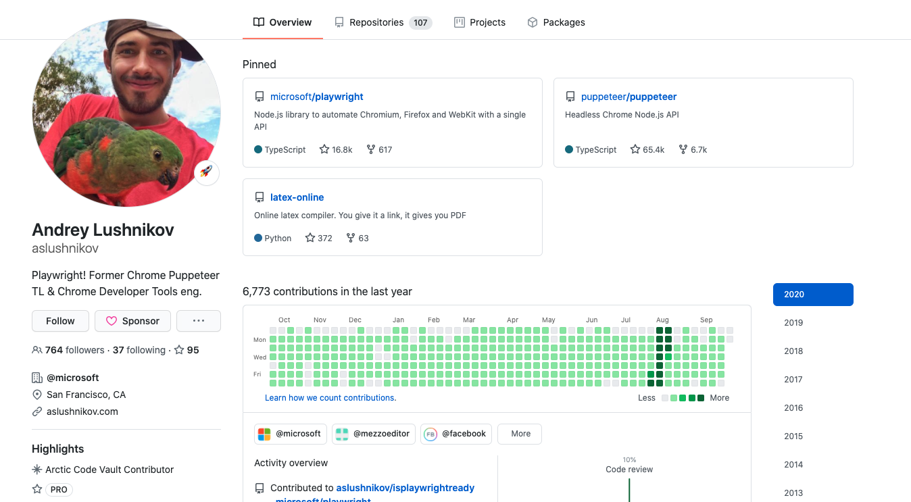

# Playwright

## 前言

主要开发者




## Playwright简介

Playwright 是一个node库，他提供了一组用来操纵浏览器的API, 通俗来说就是一个 headless 浏览器 (当然你也可以配置成有UI的，默认是没有的)。既然是浏览器，那么我们手工可以在浏览器上做的事情 Playwright 都能胜任, Playwright 翻译成中文是”编剧”意思，所以听名字就知道，想让浏览器做什么，就看你的剧本怎么写：

> - 生成网页截图或者 PDF
> - 高级爬虫，可以爬取大量异步渲染内容的网页
> - 模拟键盘输入、表单自动提交、登录网页等，实现 UI 自动化测试
> - 捕获站点的时间线，以便追踪你的网站，帮助分析网站性能问题
> - 兼容多个系统和浏览器
  
|          | Linux | macOS | Windows |
|   :---   | :---: | :---: | :---:   |
| Chromium <!-- GEN:chromium-version -->87.0.4271.0<!-- GEN:stop --> | ✅ | ✅ | ✅ |
| WebKit 14.0 | ✅ | ✅ | ✅ |
| Firefox <!-- GEN:firefox-version -->80.0b8<!-- GEN:stop --> | ✅ | ✅ | ✅ |


## 运行环境
- Node >= 10.17
- Windows 所有系统
- macOS >= 10.14
- Linux 依赖发布版本，可能需要安装额外依赖
    - Firefox 需要 Ubuntu 18.04+
> 一次性安装 `playwright` 和 `Chromium` `Firefox` `WebKit` 内核的浏览器二进制文件 
```
 npm i -D playwright
```    

## 基本用法
 
 看一个官方的 demo

 ```js
const playwright = require('playwright');
 
(async () => {
  for (const browserType of ['chromium', 'firefox', 'webkit']) {
    const browser = await playwright[browserType].launch();
    const context = await browser.newContext();
    const page = await context.newPage();
    await page.goto('http://whatsmyuseragent.org/');
    await page.screenshot({ path: `example-${browserType}.png` });
    await browser.close();
  }
})();
 ```
1. 循环三种浏览器一次执行
2. 先通过 launch() 创建一个浏览器实例 Browser 对象
3. 然后通过 Browser 对象创建浏览器上下文 context 对象
4. 然后通过 BrowserContext 对象创建页面 page  对象
4. 然后 page.goto() 跳转到指定的页面
5. 调用 page.screenshot() 对页面进行截图
6. 关闭浏览器


## 常用 API
### browserType.launch

|参数名称	|参数类型	|参数说明|
|   :---   | :---: | :---: |
| ignoreHTTPSErrors	| boolean| 	在请求的过程中是否忽略 Https 报错信息，默认为 false
| headless| 	boolean	| 是否以”无头”的模式运行 chrome, 也就是不显示 UI， 默认为 true
| executablePath	| string| 	可执行文件的路劲，playwright 默认是使用它自带的 chrome webdriver, 如果你想指定一个自己的 | webdriver 路径，可以通过这个参数设置
| slowMo| 	number| 	使 playwright 操作减速，单位是毫秒。如果你想看看 playwright 的整个工作过程，这个参数将非常有用。
| args| 	Array(String)	| 传递给 chrome 实例的其他参数，比如你可以使用”–ash-host-window-bounds=1024x768” 来设置浏览器窗口大小。更多参数参数列表可以参考这里
| handleSIGINT| 	boolean	| 是否允许通过进程信号控制 chrome 进程，也就是说是否可以使用 CTRL+C 关闭并退出浏览器.
| timeout| 	number| 	等待 Chrome 实例启动的最长时间。默认为30000（30秒）。如果传入 0 的话则不限制时间
| dumpio| 	boolean	| 是否将浏览器进程stdout和stderr导入到process.stdout和process.stderr中。默认为false。
| userDataDir	| string	| 设置用户数据目录，默认linux 是在 ~/.config 目录，window 默认在 C:\Users{USER}\AppData\Local\Google\Chrome\User Data, 其中 {USER} 代表当前登录的用户名
| env	| Object| 	指定对Chromium可见的环境变量。默认为process.env。
| devtools| 	boolean| 	是否为每个选项卡自动打开DevTools面板， 这个选项只有当 headless 设置为 false 的时候有效

### BrowserContext 对象


|事件/方法名称	|参数类型	|参数说明|
|   :---   | :---: | :---: |
| event: 'close'	|事件	| 关闭浏览器时触发 |
| event: 'page'|事件 | 新建page时触发 |
|addCookies(cookies)|方法| 添加cookies |
|clearCookies()|方法| 清空 cookie|
|grantPermissions(permissions[][, options])|方法|添加权限|
|clearPermissions()|方法|清空权限|
|close()|方法|关闭浏览器|
|cookies([urls])|方法|获取cookie|
|addInitScript(script[, arg])|方法| 文档对象创建后 执行其他脚步前注入js|
|exposeBinding(name, playwrightBinding)|方法| 给window注入全局对象 demo6|
|exposeFunction(name, playwrightFunction)|方法|注入全局方法demo7|
|newPage()|方法|创建新页面|
|pages()|方法|获取所有页面|
|route(url, handler)|方法|监听资源加载|
|setDefaultNavigationTimeout(timeout)|方法|设置导航超时时间|
|setDefaultTimeout(timeout)|方法|更改所有接受超时选项的方法的默认最大时间|
|setExtraHTTPHeaders(headers)|方法|添加自定义header|
|setGeolocation(geolocation)|方法|设置地理位置|
|setHTTPCredentials(httpCredentials)|方法|设置身份验证|
|setOffline(offline)|方法|设置是否断网环境|
|unroute(url[, handler])|方法|删除路由监听|
|waitForEvent(event[, optionsOrPredicate])|方法|等待事件触发|


## Page
|事件/方法名称		|参数说明|
|   :---   |  :---: |
| event: 'close'	| 关闭时触发 |
| event: 'console'| 新建page时触发 |
| event: 'crash'           |页面崩溃时触发|
| event: 'dialog'|出现弹框时触发|
| event: 'domcontentloaded'|dom 内容加载后触发|
| event: 'load'|js 加载后触发|
| event: 'pageerror'|页面出现未捕获的异常时触发|
| event: 'popup'|window.open('http://example.com') 方式打开页面时触发|
| page.$(selector)|类似|
| page.$$(selector)||
| page.addInitScript(script[, arg])||
| page.addScriptTag(options)||
| page.addStyleTag(options)||
| page.bringToFront()||
| page.check(selector, [options])||
| page.click(selector[, options])||
| page.close([options])||
| page.content()||
| page.context()|获取所属浏览器上下文对象|
| page.coverage||
| page.dblclick(selector[, options])||
| page.dispatchEvent(selector, type[, eventInit, options])||
| page.emulateMedia(options)||
| page.evaluate(pageFunction[, arg])||
| page.evaluateHandle(pageFunction[, arg])||
| page.exposeBinding(name, playwrightBinding)||
| page.exposeFunction(name, playwrightFunction)||
| page.fill(selector, value[, options])||
| page.focus(selector[, options])||
| page.getAttribute(selector, name[, options])||
| page.goBack([options])||
| page.goForward([options])||
| page.goto(url[, options])||
| page.hover(selector[, options])||
| page.innerHTML(selector[, options])||
| page.innerText(selector[, options])||
| page.isClosed()||
| page.keyboard||
| page.mainFrame()||
| page.mouse||
| page.opener()||
| page.pdf([options])||
| page.press(selector, key[, options])||
| page.reload([options])||
| page.route(url, handler)||
| page.screenshot([options])||
| page.selectOption(selector, values[, options])||
| page.setContent(html[, options])||
| page.setDefaultNavigationTimeout(timeout)||
| page.setDefaultTimeout(timeout)||
| page.setExtraHTTPHeaders(headers)||
| page.setInputFiles(selector, files[, options])||
| page.setViewportSize(viewportSize)||
| page.textContent(selector[, options])||
| page.title()||
| page.type(selector, text[, options])||
| page.uncheck(selector, [options])||
| page.unroute(url[, handler])||
| page.url()||
| page.viewportSize()||
| page.waitForEvent(event[, optionsOrPredicate])||
| page.waitForFunction(pageFunction[, arg, options])||
| page.waitForLoadState([state[, options]])||
| page.waitForNavigation([options])||
| page.waitForRequest(urlOrPredicate[, options])||
| page.waitForResponse(urlOrPredicate[, options])||
| page.waitForSelector(selector[, options])||
| page.waitForTimeout(timeout)||
| page.workers()||


## 参考
1. [playwright API](https://playwright.dev/#)
2. [puppeteer](https://github.com/puppeteer/puppeteer)


