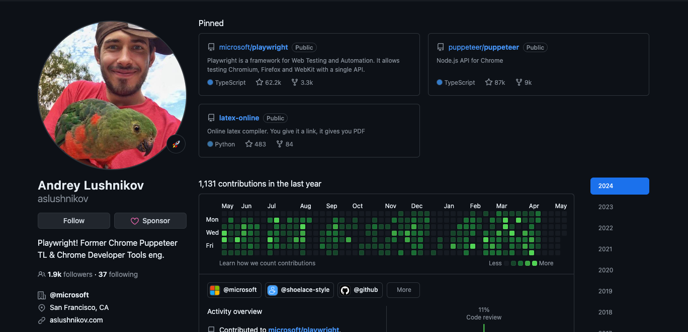
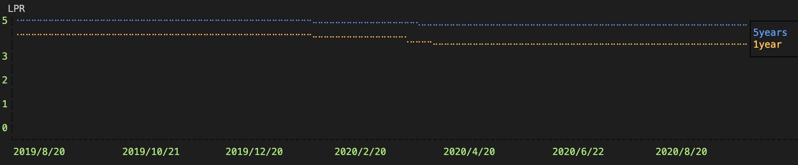

# Playwright

## 前言

主要开发者
[andreylushinkov](https://github.com/aslushnikov)


demo

## Playwright简介

Playwright 是一个node库，他提供了一组用来操纵浏览器的API, 通俗来说就是一个 headless 浏览器 (当然你也可以配置成有UI的，默认是没有的)。既然是浏览器，那么我们手可以在浏览器上做的事情 Playwright 都能胜任

> - 生成网页截图或者 PDF
> - 高级爬虫，可以爬取大量异步渲染内容的网页
> - 模拟键盘输入、表单自动提交、登录网页等，实现 UI 自动化测试
> - 捕获站点的时间线，以便追踪你的网站，帮助分析网站性能问题
> - 兼容多个系统和浏览器
  
|          | Linux | macOS | Windows |
|   :---   | :---: | :---: | :---:   |
| Chromium <!-- GEN:chromium-version -->125.0.6422.41<!-- GEN:stop --> | ✅ | ✅ | ✅ |
| WebKit 17.4 | ✅ | ✅ | ✅ |
| Firefox <!-- GEN:firefox-version -->125.0.1<!-- GEN:stop --> | ✅ | ✅ | ✅ |

## 运行环境要求

- Node.js 18+
- Windows 10+, Windows Server 2016+ or Windows Subsystem for Linux (WSL).
- MacOS 12 Monterey, MacOS 13 Ventura, or MacOS 14 Sonoma.
- Debian 11, Debian 12, Ubuntu 20.04 or Ubuntu 22.04, with x86-64 or arm64 architecture.

## 两个包

Playwright Library提供了用于启动浏览器和与浏览器交互的统一API，而Playwright Test则提供了所有这些以及完全托管的端到端测试运行器和体验。

在大多数情况下，对于端到端测试，您需要直接使用@playwright/test而不是playwright；

|     |Library|Test|
|  :-----   |:---|:---|
| 安装 |npm install playwright||
| 安装浏览器 |安装 `@playwright/browser-chromium`, `@playwright/browser-firefox` and/or `@playwright/browser-webkit`|`npx playwright install` or `npx playwright install chromium`|
|导入|`playwright`|`@playwright/test`|
|初始化|1 选择想要使用的浏览器，例如:`chromium` <br> 2 使用`browserType.launch()` 加载浏览器  <br>  3 创建一个上下文 `browser.newContext()` 并且制定上下文配置例如：`devices['iPhone 11']` <br> 4 新建一个页面 `browserContext.newPage()` |不需要手动创建|
|断言|没有内置的断言| Web端优先的断言 <br> expect(page).toHaveTitle() <br> expect(page).toHaveScreenshot() <br>  自动等待和重试|
|清理| 1 关闭上下文 `browserContext.close()` <br> 2 关闭浏览器 `browser.close()`| 不需要手动操作，自动管理|
|运行|编译&运行|`npx playwright test`|

## 开启调试模式

设置PWDEBUG=1环境变量以启动Inspector

```js
'--disable-blink-features=AutomationControlled', //这个参数用于禁用 Chrome 的某些 Blink 引擎特性，具体来说是禁用了让网站能够检测到浏览器正在被自动化控制的特性。这有助于避免被一些网站检测到使用自动化工具

// 一般前端代码可以通过 window.navigator.webdriver === true 来判断 页面是否是通过无头浏览器打开的，如果是就可以进行拦截，这个配置项可以绕过这个判断，同样可以通过注入js代码的方式实现同样的效果

 await page.evaluate(() => {
    () => {
 Object.defineProperties(navigator, {
 webdriver: {
 get: () => false,
        },
      });
    };
  });
```

## 基本用法

 看一个官方的 demo

 ```js
const { chromium, devices } = require('playwright');

(async () => {
  // 启动
  const browser = await chromium.launch();
  const context = await browser.newContext(devices['iPhone 11']);
  const page = await context.newPage();

  // 实际操作
  await page.goto('https://example.com/');

  // 关闭
  await context.close();
  await browser.close();
})();
 ```

1. 先通过 launch() 创建一个浏览器实例 Browser 对象
2. 然后通过 Browser 对象创建浏览器上下文 context 对象
3. 然后通过 BrowserContext 对象创建页面 page  对象
4. 然后 page.goto() 跳转到指定的页面
5. 调用 page.screenshot() 对页面进行截图
6. 关闭上下文
7. 关闭浏览器

## 常用 API

### browserType.launch

|参数名称 |参数类型 |参数说明|
|   :---   | :---: | :---: |
| ignoreHTTPSErrors | boolean|  在请求的过程中是否忽略 Https 报错信息，默认为 false|
| headless|  boolean | 是否以”无头”的模式运行 chrome, 也就是不显示 UI， 默认为 true|
| executablePath | string|  可执行文件的路劲，playwright 默认是使用它自带的 chrome webdriver, 如果你想指定一个自己的 | webdriver 路径，可以通过这个参数设置|
| slowMo|  number|  使 playwright 操作减速，单位是毫秒。如果你想看看 playwright 的整个工作过程，这个参数将非常有用。|
| args|  Array(String) | 传递给 chrome 实例的其他参数，比如你可以使用”–ash-host-window-bounds=1024x768” 来设置浏览器窗口大小。更多参数参数列表可以参考这里|
| handleSIGINT|  boolean | 是否允许通过进程信号控制 chrome 进程，也就是说是否可以使用 CTRL+C 关闭并退出浏览器.|
| timeout|  number|  等待 Chrome 实例启动的最长时间。默认为30000（30秒）。如果传入 0 的话则不限制时间|
| dumpio|  boolean | 是否将浏览器进程stdout和stderr导入到process.stdout和process.stderr中。默认为false。|
| userDataDir | string | 设置用户数据目录，默认linux 是在 ~/.config 目录，window 默认在 C:\Users{USER}\AppData\Local\Google\Chrome\User Data, 其中 {USER} 代表当前登录的用户名|
| env | Object|  指定对Chromium可见的环境变量。默认为process.env。|
| devtools|  boolean|  是否为每个选项卡自动打开DevTools面板， 这个选项只有当 headless 设置为 false 的时候有效|
|recordVideo: { dir: 'videos/',size: { width: 1024, height: 768 }}| 录屏||

### BrowserContext对象
|事件/方法名称 |参数类型 |参数说明|
|   :---   | :---: | :---: |
| newContext|方法 | 新建上下文 |

### BrowserContext 对象

|事件/方法名称 |参数类型 |参数说明|
|   :---   | :---: | :---: |
| newPage|方法 | 创建新页面 |
|close()|方法|关闭浏览器|


## Page

|事件/方法名称  |参数说明|
|   :---   |  :---: |

| on('close',fn) |事件 | 关闭浏览器时触发 |
| on('request',fn)|事件 | 页面发出请求时触发 |
| on('response',fn)|事件 | 请求返回时触发 |
|goto|方法| 打开一个网址 |
|waitForLoadState|方法| 等待页面加载完成 |
|$eval(selector,function(Element)#)|方法| 找到与指定选择器匹配的第一个元素 |
|$$eval(selector,function(Element)#)|方法| 找到与指定选择器匹配的所有元素 |
|evaluate|方法|用于在页面上下文中执行 JavaScript 代码。它允许在浏览器环境中执行各种操作，如操作 DOM 元素、获取页面数据、执行复杂的计算等|
|close()|方法|关闭浏览器|
|click(selector)|方法|点击元素|
|page.fill(selector, text)||填写元素|
|page.getByRole(type)||允许通过ARIA角色、ARIA属性和可访问名称来定位元素。|
|waitForTimeout|方法|等待|


=

## 参考

1. [playwright API](https://playwright.dev/#)
2. [puppeteer](https://github.com/puppeteer/puppeteer)
3. [prompt](https://www.npmjs.com/package/prompt)
